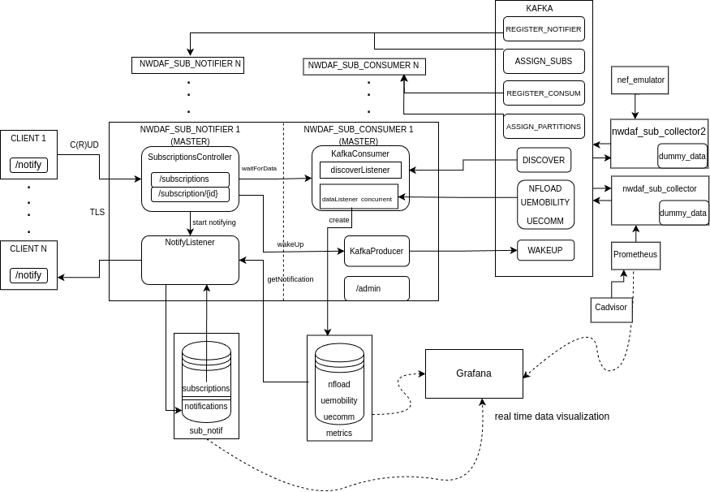

# NWDAF_SUB Project

## Description

This project is an implementation of the NWDAF event_subscription service operation according to the 3GPP Standards 
along with a distributed system for collecting and coordinating event-based data in real time that surrounds the base NWDAF service.


The above diagram shows the system architecture of the NWDAF_SUB project. The project is split into 4 main components:
- **NWDAF_SUB**              # The main server that handles the event_subscription service operation and the notifications to the clients, 
as well as the data collection from the collectors. An /admin panel is also server with real-time debug information.
<br>It has been split into 2 logical components:
    1) **NWDAF_SUB_NOTIFIER**    # The notifier that sends notifications to the clients and handles subscriptions.
    2) **NWDAF_SUB_CONSUMER**    # The consumer that consumes data from the collectors.
<br>The notifier instances are scaled using a master notifier that assigns the subscriptions evenly to the notifier instances 
using the ASSIGN_SUBS and REGISTER_NOTIFIER kafka topics.
<br>The consumer instances are scaled using a master consumer that scales up/down
and assigns the data event topic partitions evenly to the consumer instances using the ASSIGN_PARTITIONS and REGISTER_CONSUMER kafka topics.
- **NWDAF_SUB_CLIENT**       # The client that can create/update/delete subscriptions and receive notifications from the NWDAF_SUB server.
- **nwdaf_sub_collector**    # The collector that collects data from the network functions and sends it to the NWDAF_SUB server through kafka.
- **nwdaf_library**          # The library that contains the dependencies for all the other components.
- **dockprom**               # The dockerized project for collecting prometheus metrics from containers + graphana (more info [here](https://github.com/stefanprodan/dockprom)).
- **nef_emulator**           # The simulator for the NEF (Network Exposure Function) that can be used to simulate a network function that sends data to the NWDAF_SUB server.
- **kafka**                  # The kafka cluster that is used for the communication between the NWDAF_SUB server and the collectors.
## Usage

### Installing

In order to build and install this project you are going to need:

- Java JDK 17
- Apache Maven
- Docker
- The other **project repositories** in the **same** parent folder as specified in [Build](#build)

For quick first time installation:

```sh
./firstTimeInstall.sh
```

The above script for quick installation contains all the steps specified in sections [Create certificates for https](#create-certificates-for-https), [Install certificates](#install-certificates) and [Build](#build).

### Folder structure

Here's a folder structure for the project:

```
NWDAF_SUB/     # Root directory.

|- dockprom/        # Dockprom dockerized project for collecting prometheus metrics from containers + graphana (more info [here](https://github.com/stefanprodan/dockprom)).

|- src/          # Source directory with java code & resources folder.

    |- main/

        |- java/io/nwdaf/eventsubscription/

        |- resources/

            |- certificates/    # The self-signed certificates required for using HTTPS with TLS handshakes between nwdaf_sub , nwdaf_sub_client & browser used to access the app endpoints

            |- compose_files/    # The compose files for the dockerized project split into database, kafka and global related containers

            |- application.properties    # The properties file of the project (they can be overriden directly by environment variables through compose files or by command line arguements)

            |- application-production.properties    # The properties file of the project when production profile is in use

|- scripts/       # Miscellaneous (python) scripts.

|- superproject/  # Build scripts for all project components 
-> jars.

|- pom.xml      # Maven project dependencies,info & build 
targets.

|- run.sh      # Run the database,kafka & dockprom containers.

|- run_all.sh      # Run all the containers (includes dockerized nwdaf_sub,nwdaf_sub_client & nwdaf_sub_collector applications).

|- build.sh      # Initiates building project components to jars with scripts under superproject/.
```

### Setup configuration

Edit the *.env* file to configure the host and port for each component of the project (along with postgres databases' credentials -> they all use the same credentials):

```env
---
server_host=https://nwdafSub
---
default_host=https://localhost

POSTGRES_USER=postgres
POSTGRES_PASSWORD=password

prom_host=prometheus
prom_port=9090
---
```

Do the same in the resources/certificates/hosts.txt file and then add them to your system's hosts file (/etc/hosts in linux).

### Create certificates for https

In Linux:<br>
    To create the certificate for the nwdaf_sub server & the clients just run the following scripts from the src/main/resources/certificates directory:

    ./generateHosts.sh && ./generateCertificates.sh

### Install certificates

In Windows:<br>
    Go to Manage computer certificates , then right click on Trusted Root Certification Authorities
    and: All Tasks -> Import. You need to import the local-cert.crt and local-client-cert.crt files inside the src/main/resources/certificates/ directory.<br>
In Linux:<br>
    To install locally for chrome run the following script from the src/main/resources/certificates directory:

    ./installCertificatesChrome.sh

### Build

First make sure you have cloned in the same parent directory the below projects:

- **NWDAF_SUB**              # This project (can handle multiple clients at the same time)
- **NWDAF_SUB_CLIENT**      # Example client to simulate a generic network function + simple frontend for creating/updating/deleting subscriptions & receiving notifications from a NWDAF_SUB instance through the browser
- **nwdaf_sub_collector**    # Used to collect data exposed by a prometheus instance (and optionally generate dummy data)
- **nwdaf_library**          # Contains dependencies for all other components

Building the project is as simple as going to the project root directory and running:

```sh
./build.sh
```

That will install all project artifacts as jar files to the local user maven repository (~/user/.m2/repository is the default location)
Also, before running for the first time you also need to install dockprom for the prometheus nf_load metrics collection & graphana:

```sh
./installDockprom.sh
```

### Run

To run only the database and kafka containers: (in linux make sure to use sudo as necessary or create user group for docker)

```sh
./run.sh
```

After that check whether kafka1,kafka2 & kafka3 have started successfully. Also, check kafka-gen logs (kafka-gen closes automatically after generating a uuid inside compose_files/clusterID/ ).
In Windows sometimes the script files inside compose_files/scripts & the clusterID file don't work corrently because of the linebreak ^M (in vscode in the bottom right you can change the type from CRLF to LF).
Also take care that the project is inside a directory with the appopriate read/write permissions so that the docker containers can run successfully.
For testing whether kafka is working refer to [Useful Kafka Commands](#useful-kafka-commands). Now you can run the nwdaf_sub, nwdaf_sub_client & nwdaf_sub_collector repos (either the jar files with maven or the spring boot main classes).

### Run_all

To run the whole project in a dockerized environment:

```sh
./run_all.sh
```

The above command will generate 5 client containers by default according to the file: compose_files/docker-compose.yml
which will run in port 10000 and above.

### Useful Kafka Commands

- make a topic:

    ```sh
    docker exec -ti kafka1 /usr/bin/kafka-topics --create  --bootstrap-server kafka1:19092 --replication-factor 1 --partitions 4 --topic NF_LOAD
    ```

- send data:

    ```sh
    docker exec -ti kafka1 /usr/bin/kafka-console-producer --bootstrap-server kafka1:19092 --topic NF_LOAD
    ```

- consume data:

    ```sh
    docker exec -ti kafka1 /usr/bin/kafka-console-consumer --bootstrap-server kafka1:19092 --topic NF_LOAD --from-beginning
    ```

- alter number of partitions:

    ```sh
    docker exec -t kafka1 kafka-topics --bootstrap-server kafka1:19092 --alter --topic NF_LOAD --partitions 3
    ```

- describe topic:

    ```sh
    docker exec -t kafka1 kafka-topics --bootstrap-server kafka1:19092 --describe --topic NF_LOAD
    ```
  
## References

- [Pandoc](http://pandoc.org/)
- [Pandoc Manual](http://pandoc.org/MANUAL.html)
- [Wikipedia: Markdown](http://wikipedia.org/wiki/Markdown)
